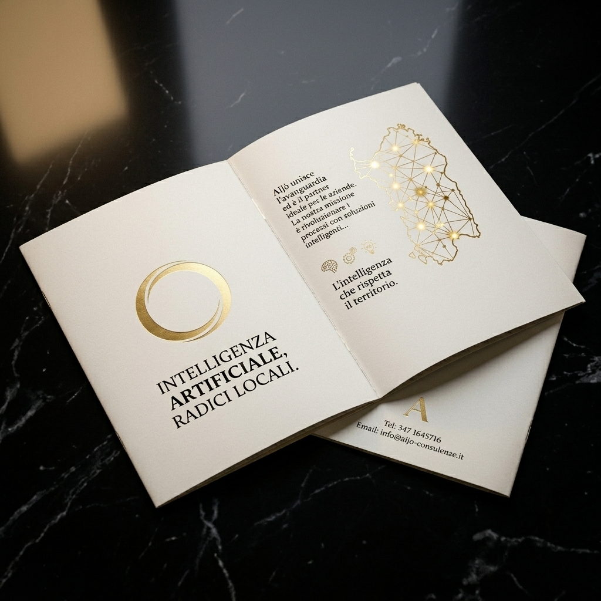

# 🏛️ AIjò — Brand Book & Rebranding Completo

Benvenuto nella pagina ufficiale di **Notion** dedicata al rebranding di **AIjò (Intelligenza Artificiale & Identità Sarda)**. Questo documento è strutturato appositamente per essere importato o copiato direttamente nel tuo spazio di lavoro di Notion, mantenendo formattazione, intestazioni, tabelle e checklist intatte.

---

## 🎯 1. La Nuova Identità: AIjò

Il rebranding trasforma la precedente dicitura generica "Consulente AI" in un brand premium, autorevole e con una fortissima identità territoriale: **AIjò**.

### 💡 Il Concetto
* **AI (Artificial Intelligence):** Intelligenza artificiale d'avanguardia, reti neurali, futuro dell'automazione e algoritmi predittivi.
* **jò (Andiamo / Forza - in Sardo):** Richiamo caloroso e identitario all'azione ("Aijò!"), che sprona all'innovazione, al movimento e al fare squadra.
* **La Fusione:** *AIjò* rappresenta il connubio perfetto tra **Eredità Storica & Intelligenza Avanzata**, offrendo alle aziende sarde un partner tecnologico solido, empatico e orientato all'azione.

---

## 🎨 2. Il Sistema di Identità Visiva (Brand Guidelines)

Il design si basa su un'estetica scura (*Luxury Dark*), minimalista e ad alto impatto visivo, evocando il prestigio dell'oreficeria tradizionale e della tecnologia futurista.

### 🔴 Tavolozza Colori
| Colore | Codice HEX | Codice RGB | Utilizzo |
| :--- | :--- | :--- | :--- |
| **Luxury Dark (Sfondo)** | `#07090e` | `RGB(7, 9, 14)` | Sfondi di pagine, flyer e materiali cartacei |
| **AIjò Gold (Accento)** | `#c8a76b` | `RGB(200, 167, 107)` | Anello, scritte, dettagli a caldo e pulsanti CTA |
| **Pure White (Testo)** | `#ffffff` | `RGB(255, 255, 255)` | Testi principali e titoli in evidenza |
| **Muted Gray (Secondario)** | `#8892b0` | `RGB(136, 146, 176)` | Sottotitoli, paragrafi e testi di lettura |

### 🖋️ Tipografia Ufficiale
* **Titoli Principali (Serif):** *Cormorant Garamond* (un font classico, regale ed elegante, che evoca l'importanza della storia, delle tradizioni e dell'incisione artistica).
* **Testi di Lettura (Sans-Serif):** *Jost* o *Inter* (geometrici, moderni, tecnologici e altamente leggibili su schermi e carta).

---

## 📐 3. Il Logo Ufficiale e Risorse Digitali

Il logo combina graficamente il profilo della fede sarda tradizionale e le tracce elettroniche di un microchip.
* **File sorgente locale:** `assets/rebranding/logo_aijo_ai_text.png`
* **Caratteristiche Fondamentali:**
  * **Anello Aperto:** Unione di filigrana orafa (sinistra) e piste PCB microchip (destra).
  * **Incisione Passante (Taglio Stencil):** La parola **AIjò** sulla banda dorata inferiore è traforata, lasciando intravedere la roccia retrostante.
  * **Carattere Serif Originale:** Mantiene l'elegante tipografia classica ad alto contrasto con la **"I"** chiaramente maiuscola (asta verticale con grazie in testa e in coda).
  * **Cuore Pulito:** Il cerchio interno è completamente vuoto.

---

## 🖨️ 4. Proposte Grafiche per la Stampa

### 📖 4.1. Brochure Monografica di Presentazione (4 Pagine A5 Rilegate)
Una monografia pieghevole in formato A5 a elevatissimo impatto estetico per la presentazione dei servizi ai clienti sardi.

* **Specifiche di Stampa Consigliate dallo Studio:**
  * Stampa su cartoncino opaco *Fedrigoni Materica Clay 300g/m²* con **intaglio laser passante** sulle lettere della scritta *"AIjò"* sulla copertina, e dettagli metallici dorati con **lamina a caldo**.
* **Struttura dei Contenuti della Brochure:**
  * **Pagina 1 (Copertina):** Logo AIjò dorato centrale, slogan *INTELLIGENZA ARTIFICIALE, RADICI LOCALI.* e sottotitolo *Consulenza in Intelligenza Artificiale · Soluzioni su misura basate in Sardegna.*
  * **Pagina 2 (Chi Siamo):** Presentazione dell'approccio concreto ("L'AI non è il futuro. È il presente. E la Sardegna merita di esserci.") e i tre pilastri operativi (Ascolto, Integrazione, Formazione).
  * **Pagina 3 (Soluzioni Reali):** Griglia con le soluzioni tratte dai prototipi della landing page (Boutique Hotel, Cantina Vinicola, Studio Associato, Artigianato Artistico, PMI Logistica).
  * **Pagina 4 (Contatti):** Invito all'azione ("La prima consulenza è gratuita") e recapiti ufficiali:
    * **Telefono:** `347 1645716`
    * **Email:** `info@aijo-consulenze.it`
    * **Web:** `www.aijo-consulenze.it`

---

## 📋 5. Tabella di Marcia (Checklist Rebranding)

- [x] **Nome & Copy:** Sostituzione di "Consulente AI" con "AIjò" nella landing page.
- [x] **Favicon:** Creazione e collegamento del file `favicon.svg` nel codice sorgente.
- [x] **Logo Ufficiale:** Perfezionamento del logo `logo_aijo_ai_text.png` con lettere "AI" maiuscole, "jò" minuscole e intaglio passante.
- [x] **Progettazione Brochure:** Creazione del copy e schema layout per la brochure 4 Pagine A5 (`assets/rebranding/brochure_4_pagine_aijo.md`).
- [x] **Mockup Brochure:** Generazione del render 3D della brochure cartacea su ardesia (`assets/rebranding/brochure_mockup.png`).
- [x] **Push & Sincronizzazione:** Upload completo di tutti i file e risorse nel repository GitHub.
- [ ] **Configurazione Email (Su Netlify):** Impostare il modulo contatti per inviare le email a `info@aijo-consulenze.it`.
- [ ] **Preparazione Stampa:** Inviare la specifica della brochure presente nella cartella `assets/rebranding/` alla tipografia per una campionatura fisica con intaglio laser e lamina d'oro.
