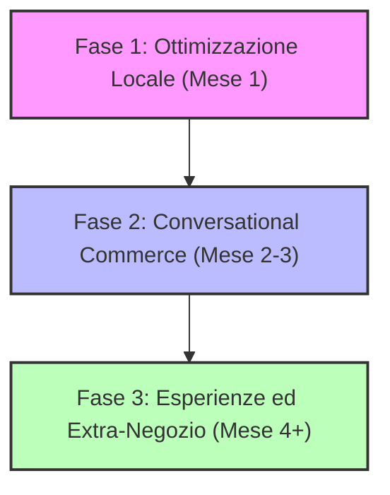

# Analisi Strategica di Mercato & Brainstorming: Ichnos Pesca Oristano

Questo documento analizza lo scenario competitivo dei negozi di articoli da pesca a Oristano e dintorni, valuta il posizionamento SEO/SEM del cliente **Ichnos Pesca**, e propone un piano d'azione commerciale basato su tendenze di consumo, analisi dei marchi e servizi innovativi extra-negozio.

---

## 1. Mappatura dello Scenario Competitivo (Oristano e Dintorni)

Oristano e la penisola del Sinis rappresentano un paradiso per la pesca sportiva (grazie a spot celebri come Cabras, Torregrande, Putzu Idu, Is Arenas e la foce del Tirso). La competizione locale è agguerrita ma divisa in segmenti molto chiari:

| Concorrente | Ubicazione | Punti di Forza | Debolezze / Gap |
| :--- | :--- | :--- | :--- |
| **Fishing Time** (di Carrus R.) | Viale Indipendenza 38, Oristano | Storicità (dal 1990), fortissima presenza online con e-commerce strutturato (*fishingtimeshop.it*), assortimento pesca + subacquea. | Comunicazione social frammentata, esperienza in negozio molto tradizionale. |
| **Armeria del Centro** | Via Tharros 51, Oristano | Posizione centralissima, specializzazione ibrida (caccia + pesca), clientela fidelizzata di fascia d'età matura. | Spazio espositivo limitato per tecniche moderne, debolezza totale sul digitale. |
| **Cadoni Gian Paolo** | Santa Giusta (OR) | Posizione strategica vicino alla laguna di Santa Giusta e alle spiagge da surfcasting del sud. | Negozio di prossimità, orientato prevalentemente a esche e attrezzature base. |
| **Prod. Ar. Pe.** | Terralba (OR) | Monopolio assoluto sulla **pesca professionale** (reti B2B, palamiti, abbigliamento pesante, funi). | Non copre in modo specialistico la pesca sportiva moderna (spinning/eging). |
| **Dettaglianti Locali** (es. Loi) | Cabras (OR) | Vicinanza immediata ai moli di partenza e agli stagni. Comodi per l'acquisto dell'ultimo minuto di esche vive. | Assortimento di canne e mulinelli ridotto, prezzi mediamente più alti. |

### I Giganti Regionali (Online & Spedizione)
* **Sergio Pesca (Alghero):** Riferimento assoluto in Sardegna e in Italia per lo spinning, l'eging e la pesca dalla barca, con un e-commerce potentissimo.
* **Matti per la Pesca (Cagliari):** Leader nel sud Sardegna, fortissimo sul supporto clienti in tempo reale via WhatsApp e sulla vendita di elettronica di bordo.

---

## 2. Audit SEO & SEM di Ichnos Pesca

### A. Posizionamento Organico (SEO) — *Stato Attuale: Critico*
* **Assenza di un Sito Proprietario:** Al momento, Ichnos Pesca non possiede un sito web ufficiale o una piattaforma e-commerce. La visibilità online è affidata a directory terze (Pagine Gialle, ReteImprese) e alla pagina Facebook.
* **Google Business Profile (Google Maps):** La scheda esiste ma è scarsamente ottimizzata. Mancano un link a un catalogo, post aggiornati con le catture dei clienti e una strategia attiva per raccogliere recensioni (fondamentali per le ricerche locali come *"negozio pesca vicino a me"* effettuate dai turisti).
* **Mancata Intercettazione delle Keyword Locali:** Per ricerche come *"esche vive Oristano"*, *"canne da pesca Oristano"* o *"articoli pesca Sinis"*, i concorrenti (in particolare *Fishing Time*) monopolizzano la prima pagina di Google grazie all'e-commerce e all'anzianità del dominio.

### B. Posizionamento a Pagamento (SEM) — *Stato Attuale: Assente*
* Nessuna campagna Google Ads attiva.
* Nessuna sponsorizzata geolocalizzata su Meta (Facebook/Instagram) focalizzata sui pescatori locali o sui turisti che arrivano nella provincia.

> [!IMPORTANT]
> **Il Gap Digitale come Opportunità:** L'assenza di un e-commerce non è necessariamente una debolezza insormontabile. Competere a livello nazionale di SEO/SEM contro giganti come Sergio Pesca o Piscor richiede budget enormi. La strategia vincente per Ichnos Pesca deve essere **iper-locale e relazionale (SEO Locale + Conversational Commerce)**.

---

## 3. Offerta Commerciale: Analisi dei Marchi & Sentiment

Ichnos Pesca ha un portafoglio di marchi ufficiali eccellente, che copre perfettamente diverse fasce di consumatori e tecniche. Ecco come valorizzarli:

### 1. SHIMANO (Mulinelli e Canne di fascia medio-alta)
* **Sentiment:** Massimo rispetto e desiderabilità. Il pescatore sardo associa Shimano a robustezza marina (fondamentale contro la salsedine e i grandi predatori come ricciole e serra).
* **Azione:** Creare eventi dedicati (es. *"Shimano Day"* con test in mare di mulinelli come lo Stella o lo Stradic) per attirare la clientela alto-spendente che attualmente compra online o a Cagliari.

### 2. TUBERTINI (Surfcasting, Bolentino e Pesca al colpo)
* **Sentiment:** Marchio storico italiano sinonimo di affidabilità tecnica per il surfcasting (pesca a fondo dalle spiagge) e la pesca dalla barca. Molto forte sui fili (fluorocarbon Gorila) e minuteria.
* **Azione:** Sfruttare la stagionalità. Il surfcasting a Oristano è una religione autunnale/invernale (Is Arenas, San Giovanni di Sinis). Preparare "rig pronti" (terminali fatti a mano con componenti Tubertini) specifici per le spiagge locali.

### 3. FEENYX (Spinning, Eging e Light Game)
* **Sentiment:** Brand moderno, dinamico ed emergente. Gode di un eccezionale sentiment tra le nuove generazioni di pescatori che praticano la pesca con esche artificiali (specialmente eging per seppie/calamari e spinning alla spigola in laguna/foce).
* **Azione:** Ichnos Pesca deve posizionarsi come il **"Tempio Feenyx"** nell'oristanese. I prodotti Feenyx hanno un'estetica accattivante ideale per i contenuti Instagram e TikTok.

---

## 4. Brainstorming: Idee Commerciali in Negozio

Per incrementare il valore medio dello scontrino e la frequenza di acquisto, possiamo "lavorare" su queste offerte:

### A. I "Kit Pronti per il Sinis" (Product Bundling)
I pescatori occasionali o i turisti spesso non sanno cosa comprare. Creiamo dei kit completi marchiati Ichnos Pesca:
* **"Kit Eging Calamaro Facile"**: Canna + mulinello Feenyx imbobinato, 2 totanare selezionate per il porto di Torregrande e una guida plastificata sugli spot del Sinis.
* **"Kit Spigola in Foce"**: Selezione di esche artificiali (siliconici e jerk) Tubertini/Feenyx adatti alle acque salmastre del Tirso.

### B. Custom Rigging Lab (Servizio in Negozio)
Molti pescatori (soprattutto chi lavora o ha poco tempo) odiano legare i terminali o imbobinare i mulinelli.
* Offrire il servizio gratuito di imbobinamento professionale sotto tensione acquistando il trecciato in negozio.
* Vendere terminali "Ichnos Pesca Custom" legati a mano dallo staff del negozio, ottimizzati per le specie locali (orate a Santa Giusta, spigole a Cabras).

### C. Distributore Automatico di Esche 24/7
* **Il Problema:** Le esche vive (coreano, arenicola, bibi) sono il prodotto a più alta frequenza di acquisto. I pescatori partono all'alba (ore 04:00) o pescano di notte, quando i negozi sono chiusi.
* **La Soluzione:** Installare un **distributore automatico refrigerato di esche vive** all'esterno del negozio in Via della Conciliazione. Questo garantisce entrate passive h24, attira clienti che poi torneranno a comprare attrezzatura negli orari di apertura e risolve un enorme punto di dolore del mercato locale.

---

## 5. Strategia Extra-Negozio (Business Model Innovation)

Per differenziarsi nettamente da internet e dai competitor fisici tradizionali, Ichnos Pesca deve vendere **esperienze e community**, non solo oggetti.

### Idea 1: Il Club "Ichnos Pesca Academy"
Organizzare clinic e masterclass a pagamento (o gratuite a fronte di una spesa minima in negozio) sul campo:
* **Autunno (Eging):** Corso pratico di pesca ai cefalopodi dagli scogli di San Giovanni o Torregrande con pro-staff Feenyx.
* **Inverno (Surfcasting):** Lettura della spiaggia ed evoluzione del moto ondoso a Is Arenas.
* **Primavera (Spinning):** Gestione degli artificiali e caccia alla spigola in foce.

### Idea 2: La Rete dei Charter & Guide di Pesca
* Oristano ha diversi skipper di pesca (charter di traina, drifting o pesca d'altura) e guide certificate da terra.
* **La Partnership:** Ichnos Pesca diventa l'infopoint e il canale di prenotazione ufficiale per queste guide. In cambio:
  1. Riceve una commissione sulle prenotazioni dei turisti.
  2. Le guide inviano i clienti a comprare le esche e l'attrezzatura consigliata direttamente da Ichnos Pesca prima dell'uscita.

### Idea 3: "La Preda del Mese" (Gamification e Social Loyalty)
Sfruttare il nome del brand: **Ichnos Pesca**.
* Creare un tabellone fisico in negozio e una rubrica settimanale su Facebook/Instagram.
* I clienti inviano la foto della cattura effettuata con attrezzatura acquistata in negozio (es. *"Presa con esca Feenyx"*).
* La foto con più interazioni vince un buono sconto o un accessorio in omaggio. Questa iniziativa genera tonnellate di pubblicità gratuita (User Generated Content) sui profili personali dei pescatori locali.

---

## 6. Piano d'Azione Proposto (Roadmap a Breve-Medio Termine)

### Fase 1: Ottimizzazione Locale & Presenza Digitale (Mese 1)
1. **Google Business Profile:** Aggiornare gli orari di apertura, caricare foto professionali del negozio e dei marchi (Shimano, Tubertini, Feenyx). Creare un QR Code in cassa che dice *"Ti sei trovato bene? Lasciaci una recensione su Google e ricevi uno sticker Ichnos Pesca!"*.
2. **Local SEO:** Creare una pagina di atterraggio gratuita (anche tramite Google Sites o Canva) molto semplice, ottimizzata per parole chiave geografiche: *"Articoli da Pesca Oristano - Ichnos Pesca"*, indicando chiaramente i marchi trattati e il contatto WhatsApp.

### Fase 2: Conversational Commerce (Mese 2-3)
1. **WhatsApp Business Catalog:** Inserire le esche disponibili settimanalmente e i 5 mulinelli/canne più venduti nel catalogo WhatsApp. Consentire il servizio *"Prenota su WhatsApp e ritira in 5 minuti in negozio"* (fondamentale per evitare code a chi ha fretta di andare a pescare).
2. **Meta Local Ads:** Avviare campagne sponsorizzate con raggio di 15-20km per promuovere l'arrivo di nuove esche o novità Feenyx, targettizzando esclusivamente appassionati di pesca sportiva.

### Fase 3: Il Rilancio Fisico ed Esperienziale (Mese 4+)
1. **Distributore di Esche 24/7:** Valutare l'investimento finanziario per il distributore esterno. È il miglior generatore di cassa ricorrente per questo settore.
2. **Primo Evento Academy:** Organizzare un raduno o una giornata di prova attrezzatura (es. *"Feenyx Test Day"*) in una spiaggia locale, consolidando la community e portando clienti in negozio.
